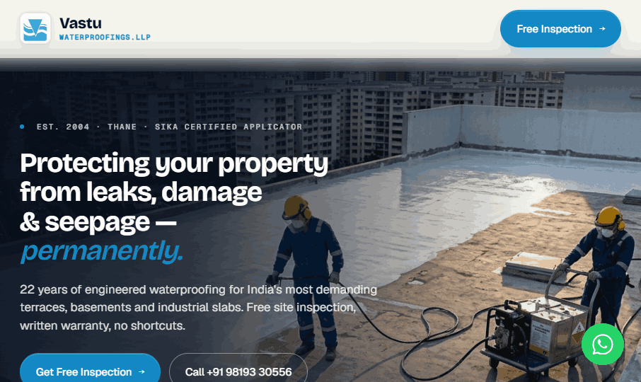

# Vastu Waterproofings LLP — Official Website

Engineered waterproofing for terraces, basements & industrial structures since 2004. Thane / Mumbai. Sika-certified applicator.

🔗 **Live site:** [www.vastuwaterproofingsllp.com](https://www.vastuwaterproofingsllp.com)

---

## About

A single-page, long-scroll marketing site for Vastu Waterproofings LLP, built as one self-contained `index.html` — all images, styles and scripts are embedded, so it runs anywhere with zero setup and no external dependencies.

## Highlights

- **Cinematic hero carousel** — auto-crossfading project photography with a subtle scroll parallax
- **Brand-aligned palette** — sky-blue accent drawn straight from the company logo
- **Fully responsive** — tuned for phone, tablet and desktop
- **Water-themed loader** — animated droplet + ripple splash while the page loads
- **Self-contained** — one file, all assets inlined; nothing to configure

## Hosting (GitHub Pages)

1. Upload `index.html` to the repository root.
2. **Settings → Pages** → Source: **Deploy from a branch** → Branch: `main` / `/root` → **Save**.
3. Add the custom domain under **Settings → Pages → Custom domain** and enable **Enforce HTTPS**.

> To update the live site, replace `index.html` with the latest build and commit. GitHub Pages redeploys automatically within a minute or two.

## Contact

**Vastu Waterproofings LLP**
📍 Thane, Maharashtra
📞 +91 98193 30556

---

© Vastu Waterproofings LLP. All rights reserved.
